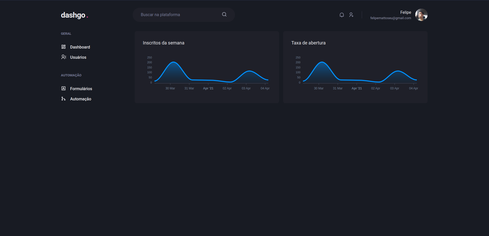

<h1 align="center">
    
    <br>
    Ignite - React - Dashgo
</h1>

<h4 align="center">
  Dashboard created with next.js and chakra-ui :zap:
</h4>



## :information_source: How To Use

```bash
git clone https://github.com/felipe-jm/ignite-react-dashgo.git

cd ignite-react-dashgo

yarn

yarn dev
```

## :memo: License

This project is under the MIT license. See the [LICENSE](https://github.com/felipe-jm/ignite-react-dashgo/blob/master/LICENSE) for more information.

---

Made with much :heart: and :muscle: by Felipe Jung :blush: <a href="https://www.linkedin.com/in/felipe-jung/">Talk to me!</a>
